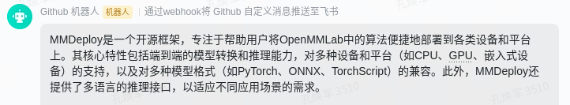

English | [简体中文](README_zh.md)

<div align="center">


<div align="center">
  <a href="resource/figures/wechat.jpg" target="_blank">
    
  </a>
  <a href="https://pypi.org/project/huixiangdou" target="_blank">
    
  </a>
  <a href="https://youtu.be/ylXrT-Tei-Y" target="_blank">
    
  </a>
  <a href="https://www.bilibili.com/video/BV1S2421N7mn" target="_blank">
    
  </a>
  <a href="https://discord.gg/TW4ZBpZZ" target="_blank">
    
  </a>
  <a href="https://arxiv.org/abs/2401.08772" target="_blank">
    
  </a>
</div>

</div>

HuixiangDou is a **group chat** assistant based on LLM (Large Language Model).

Advantages:

1. Design a three-stage pipeline of preprocess, rejection and response to cope with group chat scenario, answer user questions without message flooding, see [2401.08772](https://arxiv.org/abs/2401.08772) and [2405.02817](https://arxiv.org/abs/2405.02817)
2. Low cost, requiring only 1.5GB memory and no need for training
3. Offers a complete suite of Web, Android, and pipeline source code, which is industrial-grade and commercially viable

Check out the [scenes in which HuixiangDou are running](./huixiangdou-inside.md) and join [WeChat Group](resource/figures/wechat.jpg) to try AI assistant inside.

If this helps you, please give it a star ⭐

# 🔆 News

The web portal is available on [OpenXLab](https://openxlab.org.cn/apps/detail/tpoisonooo/huixiangdou-web), where you can build your own knowledge assistant without any coding, using WeChat and Feishu groups.

Visit web portal usage video on [YouTube](https://www.youtube.com/watch?v=ylXrT-Tei-Y) and [BiliBili](https://www.bilibili.com/video/BV1S2421N7mn).

- \[2024/05\] [wkteam WeChat access](./docs/add_wechat_commercial_zh.md), support image, URL and reference resolution in group chat
- \[2024/05\] Add [Coreference Resolution fine-tune](./sft)

  <table>
      <tr>
          <td>🤗</td>
          <td><a href="https://huggingface.co/tpoisonooo/HuixiangDou-CR-LoRA-Qwen-14B">LoRA-Qwen1.5-14B</a></td>
          <td><a href="https://huggingface.co/tpoisonooo/HuixiangDou-CR-LoRA-Qwen-32B">LoRA-Qwen1.5-32B</a></td>
          <td><a href="https://huggingface.co/datasets/tpoisonooo/HuixiangDou-CR/tree/main">alpaca data</a></td>
          <td><a href="https://arxiv.org/abs/2405.02817">arXiv</a></td>
      </tr>
  </table>

- \[2024/04\] Add [SFT data annotation and examples](./docs/rag_annotate_sft_data_zh.md)

- \[2024/04\] Update [technical report](./resource/HuixiangDou.pdf)

- \[2024/04\] Release [web server](./web) source code 👍

- \[2024/03\] New [wechat integration method](./docs/add_wechat_accessibility_zh.md) with [**prebuilt android apk**](https://github.com/InternLM/HuixiangDou/releases/download/v0.1.0rc1/huixiangdou-1.0.0.apk) !

- \[2024/02\] \[experimental\] Integrated multimodal model into our [wechat group](https://github.com/InternLM/HuixiangDou/blob/main/resource/figures/wechat.jpg) for OCR

# 📖 Support

<table align="center">
  <tbody>
    <tr align="center" valign="bottom">
      <td>
        <b>Model</b>
      </td>
      <td>
        <b>File Format</b>
      </td>
      <td>
        <b>IM Application</b>
      </td>
    </tr>
    <tr valign="top">
      <td>

- [InternLM2](https://github.com/InternLM/InternLM)
- [Qwen/Qwen2](https://github.com/QwenLM/Qwen2)
- [KIMI](https://kimi.moonshot.cn)
- [DeepSeek](https://www.deepseek.com)
- [Step](https://platform.stepfun.com)
- [GLM (ZHIPU)](https://www.zhipuai.cn)
- [SiliconCloud](https://siliconflow.cn/zh-cn/siliconcloud)
- [Xi-Api](https://api.xi-ai.cn)
- [OpenAOE](https://github.com/InternLM/OpenAOE)

</td>
<td>

- pdf
- word
- excel
- ppt
- html
- markdown
- txt

</td>

<td>

- WeChat
- Lark
- ..

</td>

</tr>
  </tbody>
</table>

# 📦 Hardware

The following are the hardware requirements for running. It is suggested to follow this document, starting with the basic version and gradually experiencing advanced features.

|        Version         | GPU Memory Requirements |                                                                                               Features                                                                                               |                                Tested on Linux                                |
| :--------------------: | :---------------------: | :--------------------------------------------------------------------------------------------------------------------------------------------------------------------------------------------------: | :---------------------------------------------------------------------------: |
| Cost-effective Edition |          1.5GB          | Use [openai API](https://pypi.org/project/openai/) (e.g., [kimi](https://kimi.moonshot.cn) and [deepseek](https://platform.deepseek.com)) to handle source code-level issues <br/> Free within quota |  |
|    Standard Edition    |          19GB           |                                                                             Deploy local LLM can answer basic questions                                                                              |   |
|    Complete Edition    |          40GB           |                                                                Fully utilizing search + long-text, answer source code-level questions                                                                |   |

# 🔥 Run

First [agree BCE license](https://huggingface.co/maidalun1020/bce-embedding-base_v1) and login huggingface.

```shell
huggingface-cli login
```

Then install requirements.

```bash
# parsing `word` format requirements
apt update
apt install python-dev libxml2-dev libxslt1-dev antiword unrtf poppler-utils pstotext tesseract-ocr flac ffmpeg lame libmad0 libsox-fmt-mp3 sox libjpeg-dev swig libpulse-dev
# python requirements
pip install -r requirements.txt
```

## Standard Edition

The standard edition runs [text2vec](https://huggingface.co/maidalun1020/bce-embedding-base_v1), rerank and a 7B model locally.

**STEP1.** First, without rejection pipeline, run test cases:

```shell
# Standalone mode
# main creates a subprocess to run the LLM API, then sends requests to the subprocess
python3 -m huixiangdou.main --standalone
..
..Topics unrelated to the knowledge base.."How to install mmpose?"
..Topics unrelated to the knowledge base.."How's the weather tomorrow?"
```

You can see that the result of handling the example question in `main.py` is the same, whether it's about `mmpose installation` or `How's the weather tomorrow?`

**STEP2.** Use mmpose and test documents to build a knowledge base and enable the rejection pipeline

Copy all the commands below (including the '#' symbol) and execute them.

```shell
# Download knowledge base documents
cd HuixiangDou
mkdir repodir
git clone https://github.com/open-mmlab/mmpose --depth=1 repodir/mmpose
git clone https://github.com/tpoisonooo/huixiangdou-testdata --depth=1 repodir/testdata

# Save the features of repodir to workdir
mkdir workdir
python3 -m huixiangdou.service.feature_store
```

> \[!NOTE\]
>
> <div align="center">
> If restarting local LLM is too slow, first <b>python3 -m huixiangdou.service.llm_server_hybrid</b>, then open a new terminal, and only execute <b>python3 -m huixiangdou.main</b> without restarting LLM.
> </div>

Then rerun `main`, Huixiangdou will be able to answer `mmpose installation` and reject casual chats.

```bash
python3 -m huixiangdou.main --standalone
..success.. To install mmpose, you should..
..Topics unrelated to the knowledge base.."How's the weather tomorrow?"
```

Please adjust the `repodir` documents, [good_questions](./resource/good_questions.json), and [bad_questions](./resource/bad_questions.json) to try your own domain knowledge (medical, financial, power, etc.).

**STEP3.** Test sending messages to Feishu group (optional)

This step is just for testing algorithm pipeline, `STEP4` also support IM applications.

Click [Create Feishu Custom Bot](https://open.feishu.cn/document/client-docs/bot-v3/add-custom-bot) to obtain the callback WEBHOOK_URL and fill it in config.ini

```ini
# config.ini
...
[frontend]
type = "lark"
webhook_url = "${YOUR-LARK-WEBHOOK-URL}"
```

Run. After the end, the technical assistant's response will be sent to Feishu group.

```shell
python3 -m huixiangdou.main --standalone
```



- [Integrate Feishu group receiving, sending, and withdrawal](./docs/add_lark_group_zh.md)
- [Integrate personal WeChat access](./docs/add_wechat_accessibility_zh.md)
- [Integrate wkteam WeChat access](./docs/add_wechat_commercial_zh.md)

**STEP4.** WEB service and IM applications

We provide a complete front-end UI and backend service that supports:

- Multi-tenant management
- Zero-programming access to Feishu, WeChat groups

See the effect at [OpenXlab APP](https://openxlab.org.cn/apps/detail/tpoisonooo/huixiangdou-web), please read the [web deployment document](./web/README.md).

## Cost-effective Edition

If your machine only has 2G GPU memory, or if you are pursuing cost-effectiveness, you only need to read [this Zhihu document](https://zhuanlan.zhihu.com/p/685205206).

The cost-effective version only discards the local LLM and uses the remote LLM instead, and other functions are the same as the standard version.

Take kimi as an example, fill in the API KEY applied from the [official website](https://platform.moonshot.cn/) into `config-2G.ini`

```bash
# config-2G.ini
[llm]
enable_local = 0
enable_remote = 1
...
remote_type = "kimi"
remote_api_key = "YOUR-API-KEY-HERE"
```

> \[!NOTE\]
>
> <div align="center">
> The worst case for each Q&A is to call the LLM 7 times, subject to the free user RPM limit, you can modify the <b>rpm</b> parameter in config.ini
> </div>

Execute the command to get the Q&A result

```shell
python3 -m huixiangdou.main --standalone --config-path config-2G.ini # Start all services at once
```

## Complete Edition

The HuixiangDou deployed in the WeChat group is the complete version.

When 40G of GPU memory is available, long text + retrieval capabilities can be used to improve accuracy.

Please read following topics

- [Refer to config-advanced.ini to improve precision](./docs/full_dev_en.md)
- [Use rag.py to annotate SFT training data](./docs/rag_annotate_sft_data_zh.md)
- [Coreference resolution fine-tune](./sft)
- [Using the commercial WeChat integration, add image analysis, public account parsing, and reference resolution](./docs/add_wechat_commercial_zh.md)

# 🛠️ FAQ

1. What if the robot is too cold/too chatty?

   - Fill in the questions that should be answered in the real scenario into `resource/good_questions.json`, and fill the ones that should be rejected into `resource/bad_questions.json`.
   - Adjust the theme content in `repodir` to ensure that the markdown documents in the main library do not contain irrelevant content.

   Re-run `feature_store` to update thresholds and feature libraries.

   ⚠️ You can directly modify `reject_throttle` in config.ini. Generally speaking, 0.5 is a high value; 0.2 is too low.

2. Launch is normal, but out of memory during runtime?

   LLM long text based on transformers structure requires more memory. At this time, kv cache quantization needs to be done on the model, such as [lmdeploy quantization description](https://github.com/InternLM/lmdeploy/blob/main/docs/en/quantization). Then use docker to independently deploy Hybrid LLM Service.

3. How to access other local LLM / After access, the effect is not ideal?

   - Open [hybrid llm service](./huixiangdou/service/llm_server_hybrid.py), add a new LLM inference implementation.
   - Refer to [test_intention_prompt and test data](./tests/test_intention_prompt.py), adjust prompt and threshold for the new model, and update them into [worker.py](./huixiangdou/service/worker.py).

4. What if the response is too slow/request always fails?

   - Refer to [hybrid llm service](./huixiangdou/service/llm_server_hybrid.py) to add exponential backoff and retransmission.
   - Replace local LLM with an inference framework such as [lmdeploy](https://github.com/internlm/lmdeploy), instead of the native huggingface/transformers.

5. What if the GPU memory is too low?

   At this time, it is impossible to run local LLM, and only remote LLM can be used in conjunction with text2vec to execute the pipeline. Please make sure that `config.ini` only uses remote LLM and turn off local LLM.

6. `No module named 'faiss.swigfaiss_avx2'`
   locate installed `faiss` package

   ```python
   import faiss
   print(faiss.__file__)
   # /root/.conda/envs/InternLM2_Huixiangdou/lib/python3.10/site-packages/faiss/__init__.py
   ```

   add soft link

   ```Bash
   # cd your_python_path/site-packages/faiss
   cd /root/.conda/envs/InternLM2_Huixiangdou/lib/python3.10/site-packages/faiss/
   ln -s swigfaiss.py swigfaiss_avx2.py
   ```

# 🍀 Acknowledgements

- [KIMI](https://kimi.moonshot.cn/): long context LLM
- [BCEmbedding](https://github.com/netease-youdao/BCEmbedding): Bilingual and Crosslingual Embedding (BCEmbedding) in English and Chinese
- [Langchain-ChatChat](https://github.com/chatchat-space/Langchain-Chatchat): ChatGLM Application based on Langchain
- [GrabRedEnvelope](https://github.com/xbdcc/GrabRedEnvelope): Grab Wechat RedEnvelope

# 📝 Citation

```shell
@misc{kong2024huixiangdou,
      title={HuixiangDou: Overcoming Group Chat Scenarios with LLM-based Technical Assistance},
      author={Huanjun Kong and Songyang Zhang and Jiaying Li and Min Xiao and Jun Xu and Kai Chen},
      year={2024},
      eprint={2401.08772},
      archivePrefix={arXiv},
      primaryClass={cs.CL}
}

@misc{kong2024huixiangdoucr,
      title={HuixiangDou-CR: Coreference Resolution in Group Chats},
      author={Huanjun Kong},
      year={2024},
      eprint={2405.02817},
      archivePrefix={arXiv},
      primaryClass={cs.CL}
}
```
