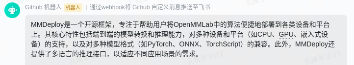

# HuixiangDou
<small> [简体中文](README.md) | English </small>

[](./LICENSE)


HuixiangDou is a domain-specific knowledge assistant based on Large Language Models (LLMs). It has the following key features:

1. It is designed to handle complex scenarios like group chats, answering users' questions without creating message overflow.
2. It proposes an algorithmic pipeline for addressing technical queries.
3. It has low deployment costs; it just requires an LLM model that fulfills 4 traits to answer most user questions. See [Technical Report](./resource/HuixiangDou.pdf) for details.

Check out [HuixiangDou Inside](./huixiangdou-inside.md).

# 🔥 Deployment

We'll illustrate how to deploy the knowledge assistant in Feishu groups using lmdeploy & mmpose as examples.

## STEP1: Build Topic Feature
```bash
# Download chat topics
mkdir repodir
git clone https://github.com/openmmlab/mmpose --depth=1 repodir/mmpose
git clone https://github.com/internlm/lmdeploy --depth=1 repodir/lmdeploy

# Create feature library
cd HuixiangDou && mkdir workdir # create working directory
python3 -m pip install -r requirements.txt # install dependencies
python3 service/feature_store.py repodir workdir # save features of repodir to workdir
```
After running these commands, HuixiangDou will be able to discern which user topics to process and which casual talks to reject. Edit [good_questions](./resource/good_questions.json) and [bad_questions](./resource/bad_questions.json) to try your domain knowledge (such as medical, financial, electricity, etc.).

```bash
# Accept technical topics
process query: Does mmdeploy now support mmtrack model conversion?
process query: Are there any Chinese text-to-speech models?
# Reject casual chats
reject query: What's for lunch today?
reject query: How is HuixiangDou made?
```

## STEP2: Launch Basic Tech Assistant

**Configure Free TOKEN**

HuixiangDou uses a search engine; click [serper](https://serper.dev/api-key) to get a limited WEB_SEARCH_TOKEN and input it into `config.ini`.

```shell
# config.ini
..
[web_search]
x_api_key = "${YOUR-X-API-KEY}"
..
```

**Test Q&A Effect**

Ensure GPU memory exceeds 20GB (like 3090 or above). If the memory is lower, please modify according to the FAQ.

When running for the first time, `internlm2-7B` and `text2vec-large-chinese` will be automatically downloaded from the configuration. Please ensure network connectivity.

  * **Non-docker users**: If you **do not** use docker, you can start all services at once.
    ```bash
    # standalone
    python3 main.py workdir --standalone
    ..
    ErrorCode.SUCCESS, To install MMDeploy, you first need to prepare an environment that supports Python 3.6+ and PyTorch 1.8+. Then, you can install MMDeploy through the following steps..
    ```

  * **Docker users**: If you are using docker, HuixiangDou's Hybrid LLM Service can be separately deployed.
    ```bash
    # Start service
    python3 service/llm_server_hybrid.py
    ```
    Open a new terminal, put the host IP into `config.ini`, and run

    ```bash
    # config.ini
    [llm]
    ..
    client_url = "http://10.140.24.142:39999/inference" # example

    python3 main.py workdir
    ```

## STEP3: Integrate into Feishu (Optional)

Click [create Feishu custom bot](https://open.feishu.cn/document/client-docs/bot-v3/add-custom-bot) to obtain a callback WEBHOOK_URL and fill it into config.ini.

```shell
# config.ini
..
[frontend]
type = "lark"
webhook_url = "${YOUR-LARK-WEBHOOK-URL}"
```

Run the following command. After running, the technical assistant's reply will be sent to the Feishu group.
```shell
python3 main.py workdir
```



If you need to read Feishu group messages, see [Feishu Developer Square - Add Application Capability - Robot](https://open.feishu.cn/app?lang=zh-CN).

## STEP4: Advanced Configuration (Optional)
In order to further improve the assistant's answering experience, the more of the following features are enabled, the better.

1. Using a higher precision local LLM

    Adjust the `llm.local` model path in `config.ini`.
    This option has a significant effect but requires larger GPU memory.

2. Hybrid LLM Service

    For LLM services that support the openai interface, HuixiangDou can utilize its Long Context ability.
    Taking kimi as an example, below is a configuration example for `config.ini`:

    ```bash
    # config.ini
    [llm.server]
    ..
    # open https://platform.moonshot.cn/
    remote_type = "kimi"
    remote_api_key = "YOUR-KIMI-API-KEY"
    remote_llm_max_text_length = 128000
    remote_llm_model = "moonshot-v1-128k"
    ```
    We also support GPT API. Please note that this feature will increase response time and operating costs.

 3. Repo Search Enhancement

    This feature is suitable for handling difficult issues that require basic development skills to adjust the prompt.

    * Click [sourcegraph-settings-access](https://sourcegraph.com/users/tpoisonooo/settings/tokens) to get a token

        ```bash
        # Open https://github.com/sourcegraph/src-cli#installation
        curl -L https://sourcegraph.com/.api/src-cli/src_linux_amd64 -o /usr/local/bin/src && chmod +x /usr/local/bin/src

        # Fill in the token in config.ini
        [sg_search]
        ..
        src_access_token = "${YOUR_ACCESS_TOKEN}"
        ```
    
    * Edit the repository's name and description, taking opencompass as an example

        ```bash
        # config.ini
        # Add your repository here, we just take opencompass and lmdeploy as examples
        [sg_search.opencompass]
        github_repo_id = "open-compass/opencompass"
        introduction = "Used for evaluating Large Language Models (LLM).."
        ```
    
    * Use `python3 service/sg_search.py` for a single test, and the returned content should include opencompass source code and documentation

        ```bash
        python3 service/sg_search.py
       ..
       "filepath": "opencompass/datasets/longbench/longbench_trivia_qa.py",
       "content": "from datasets import Dataset..
       ```

    Run `main.py`, and when the time is right, HuixiangDou will enable search enhancement.


# 🛠️ FAQ 

1. How to connect other IMs?
    * WeChat: Enterprise WeChat, see [Enterprise WeChat Application Development Guide](https://developer.work.weixin.qq.com/document/path/90594). As for personal WeChat, we have confirmed with the WeChat team that there is currently no API, you need to search and learn by yourself.
    * DingTalk: Refer to [DingTalk Open Platform - Custom Robot Access](https://open.dingtalk.com/document/robots/custom-robot-access).

2. Is the bot too cold/too chatty?

    * Fill in the questions that should be answered in `resource/good_questions.json`, and the ones that should be rejected in `resource/bad_questions.json` according to real scenarios.
    * Adjust the theme content in `repodir`, ensuring that the markdown documents in the base library do not contain irrelevant scene content.

    Re-run `service/feature_store.py` to update threshold values and the feature library.

3. What if GPU memory runs out during operation?

    LLMs based on transformers structure require more memory for long texts. In this case, kv cache quantization is needed for the model, such as [lmdeploy quantization instructions](https://github.com/InternLM/lmdeploy/blob/main/docs/en/kv_int8.md). Then use docker to separately deploy Hybrid LLM Service.

4. How to connect other local LLMs? What if the effect is unsatisfactory after connection?

    * Open [hybrid llm service](./service/llm_server_hybrid.py) and add new LLM inference implementations.
    * Refer to [test_intention_prompt and test data](./tests/test_intention_prompt.py), adjust the prompt and threshold for the new model, and update them in [worker.py](./service/worker.py).

5. What if the response is too slow or requests always fail?

    * Refer to [hybrid llm service](./service/llm_server_hybrid.py) to add exponential backoff retransmission.
    * Replace local LLM with inference frameworks like [lmdeploy](https://github.com/internlm/lmdeploy), instead of the native huggingface/transformers.
      
6. What if the GPU memory is too low?

    In this case, you can't run local LLM, only remote LLM combined with text2vec to execute pipeline. Make sure `config.ini` only uses remote LLM, and turn off local LLM.

# 📝 License
The project uses the [BSD 3-Clause License](./LICENSE).
