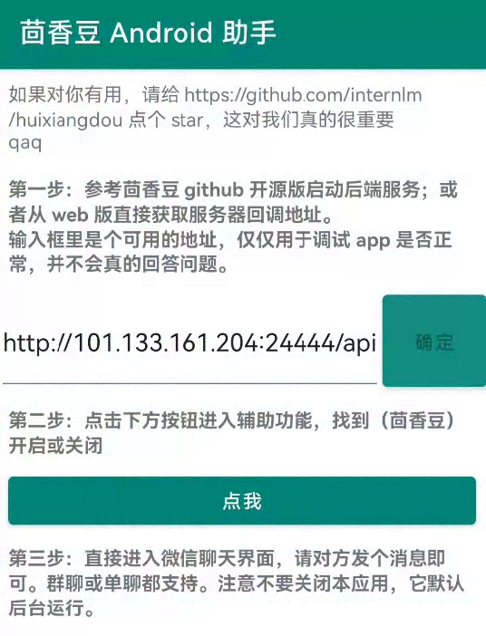
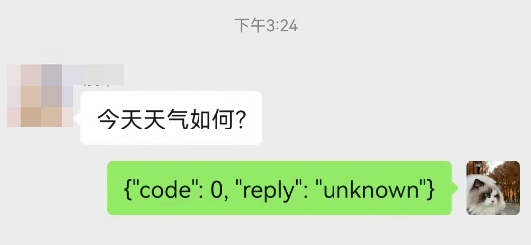

# 新集成个人微信示例

在之前的 [魔改 wechaty 方案](./add_wechat_group_zh.md) 我们一共介绍了 7 种方法。这次提供第 5 种方案的具体实现，基于 Android Accessibility 读写前端，和“抢红包”软件原理相同。

由于没有 Appium/Selenium 框架做中间商，比较稳定。

## 一、准备工作

- 一个 android 手机，对性能和系统版本都没要求
- 微信版本 8.0.47，不同版本的 view id 不同可能没效果。[代码里](https://github.com/InternLM/HuixiangDou/blob/main/android/demo/src/main/java/com/carlos/grabredenvelope/demo/WechatConstants.kt)只记了这个版本的 id
- 一个测试用的微信号

## 二、运行

从 [这里](https://github.com/InternLM/HuixiangDou/releases) 下载编译好的 apk，按说明做即可。



现在这个效果，记得关掉手机自动熄屏：



## FAQ

1. 源码在哪儿？

   在 repo 的 android 目录，需要 kotlin+java 开发能力

2. 我的微信版本更高/更低怎么办？

   一、【不想开发】去微信官网找个 8.0.47 版本安装

   二、【愿意开发】用 DDMS dump 一下 view 结构；然后打开源码的 `WechatConstants.kt` 文件，把你的版本的 id 填进去，build 即可

   改完请发个 PR

   ```java
   if (version == "8.0.47") {
       RES_ID_GROUP_NAME..
       RES_ID_USER_NAME..
       RES_ID_USER_CONTENT..
       RES_ID_EDIT_TEXT..
   } else if ( 你的版本 ) {
       ..
   } else {
       Log.w("msg", "unknown version, maybe incompatible")
   }
   ```
