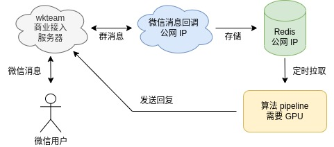

# 集成个人微信服务器商业版

用户反馈[免费版](./add_wechat_accessibility_zh.md)不能同时支持多个群，事实上要获取群里的视频和语音也很难用 accessibility 方式完成。

因此我们介绍[商业版 wkteam](https://wkteam.cn) 接入方式，支持图片、公众号解析。

> [!Warning]
> <div align="center">
> wkteam 曾变更过经营主体，🚨<strong>注意财产安全</strong> </br>
> 打开 wkteam.cn 和 121.229.29.88:6327， 会发现 UI 相同但数据库不通，须仔细咨询运营方
> </div>

整个服务需要准备以下资源：
* wkteam 账号
* 一个微信号，支持 22 个国内地区，见[文档](https://wkteam.cn/api-wen-dang2/deng-lu/huo-qu-wei-xin-er-wei-ma2.html)
* GPU，最少 2G 显存

## 一、部署图

考虑到算法服务可能不在线、没有公网 IP，整个设计分三部分：

- **redis** 存储微信消息，需要部署在公网
- **消息回调** 接收 wkteam 提供的推送，转存到 redis，需要公网
- **算法 pipeline** 从 redis 拉取消息处理，结果直接发给 wkteam



这么设计的好处是：
* 消息回调实现简单，很稳定一般不需重启
* 信息都被缓存进了 redis，修改算法后重启，不会漏处理群里的消息

## 二、wkteam 登录、测试消息缓存

启动公网 redis。

在公网机器中填写 `config.ini`，假设我们的 ip 是 `101.133.161.11`；假设我们的地区是上海。

> 注意 `proxy` 地区填错会导致封号！ 首次使用 wkteam，24 小时后要重新登录一次

```bash
# wechat message callback server ip
callback_ip = "101.133.161.11"
callback_port = 9528

# public redis config
redis_host = "101.133.161.11"
redis_port = "6380"
redis_passwd = "hxd123"

# wkteam
account = ""
password = ""
# !!! `proxy` is very import parameter, it's your account location
# 1：北京 2：天津 3：上海 4：重庆 5：河北
# 6：山西 7：江苏 8：浙江 9：安徽 10：福建
# 11：江西 12：山东 13：河南 14：湖北 15：湖南
# 16：广东 17：海南 18：四川 20：陕西
# bad proxy would cause account deactivation !!!
proxy = 3
```

运行 `wechat.py`，微信扫描二维码登录，然后注册 callback 地址。

```bash
python3 huixiangdou/frontend/wechat.py --login
```

若运行成功，会看到以下日志，同时 `wkteam/license.json` 会记录完整的账号信息。

```bash
# 设置 callback 地址日志
.. set callback url http://xxx/callback
.. {"code":"1000","message":"设置成功","data":null}
.. login success, all license saved to wkteam/license.json

# 保存账号信息
cat wkteam/license.json
{
  "auth": "xxx",
  "wId": "xxx",
  "wcId": "wxid_xxx",
  "qrCodeUrl": "http://wxapii.oosxxx"
}
```

## 三、运行算法 pipeline

因为算法 pipeline 要发消息给微信，所以要把公网的 wkteam 目录，拷贝到 GPU 所在机器上。

> 为什么不在公网统一处理所有微信收发？看起来设计简化了，实际上开发调试都巨麻烦。

填写 `config.ini`，运行。[config-wkteam-example.ini](../config-wkteam-example.ini) 是一个填写示例：
* LLM 只使用 kimi
* 群列表为茴香豆用户群。`wkteam/wechat_message.jsonl` 记录了所有消息、可以得知群号
* 开启指代消歧

```bash
python3 -m huixiangdou.main
```

这套服务会：
* 下载群里的图片。如果使用 kimi，会尝试 OCR
* 尝试解析群里的公众号消息，失败则只使用小标题

## 四、【可选】指代消歧

根据 [2405.02817](../sft/)，我们基于真实数据微调了 Qwen 系列模型。
从 [HuggingFace](https://huggingface.co/tpoisonooo/HuixiangDou-CR-LoRA-Qwen-14B) 下载 LoRA 权重，合并权重并部署成 openai API

```bash
# 用 axolotl 合并 weight
python3 -m axolotl.cli.merge_lora examples/qwen/qwen2-lora-14B.yaml

# 用 vLLM 部署
python -m vllm.entrypoints.openai.api_server --served-model-name coref-res --model /path/to/qwen14b-lora-merged/ --port 9999 --max-model-len 4096 --gpu-memory-utilization 0.8
```

把端口号配置进 `config.ini` ，重新运行算法 pipeline 即可。
