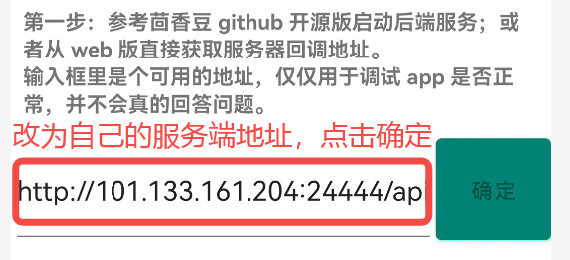
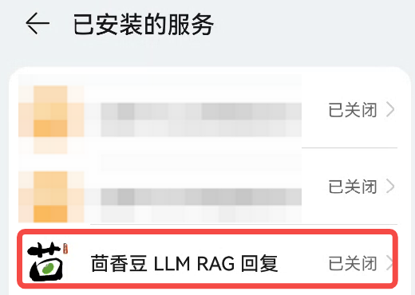
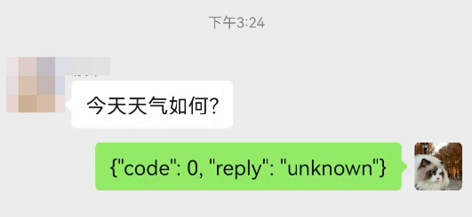

# 零编程集成微信

## 一、准备工作

* 一个 android 手机，对性能和系统版本都没要求
* 微信版本 8.0.47 （其他版本可能没效果）和一个测试用的微信号

## 二、运行

从 [这里](https://www.lanzoub.com/iJBEG1ql9u6j) 下载编译好的 apk。

1. 填写 web 版提供的微信回调地址，点击 “确定”

    

2. 点击 “点我”，找到“茴香豆 LLM RAG 回复” 打开或关闭

    

3. 进入聊天界面，请对方发送消息即可体验

    

## FAQ

1. 我的微信版本更高/更低怎么办？

    一、【不想开发】去微信官网找个 8.0.47 版本安装

    二、【愿意开发】用 DDMS dump 一下 view 结构；然后打开源码的 `WechatConstants.kt` 文件，把你的版本的 id 填进去，build 即可
    
    改完请发个 PR

    ```java
    if (version == "8.0.47") {
        RES_ID_GROUP_NAME..
        RES_ID_USER_NAME..
        RES_ID_USER_CONTENT..
        RES_ID_EDIT_TEXT..
    } else if ( 你的版本 ) {
        ..
    } else {
        Log.w("msg", "unknown version, maybe incompatible")
    }
    ```

2. android 源码在哪儿？

    在开源项目 `https://github.com/internlm/huixiangdou` android 目录，需要 kotlin+java 开发能力
