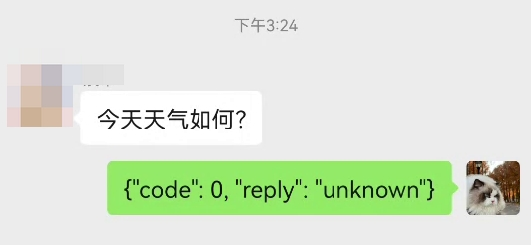

# 集成个人微信 android 免费版示例

在之前的 [魔改 wechaty 方案](./add_wechat_group_zh.md) 我们一共介绍了 7 种方法。这次提供第 5 种方案的具体实现，基于 Android Accessibility 读写前端，和“抢红包”软件原理相同。

由于没有 Appium/Selenium 框架做中间商，比较稳定。

## 一、演示视频

这里是 BiliBili 2 分钟演示视频 https://www.bilibili.com/video/BV1S2421N7mn/

## 二、准备工作

- 一个 android 手机，对性能和系统版本都没要求
- 微信版本 8.0.47 / 8.0.48 / 8.0.49，其他版本的 view id 可能变化。[代码里](https://github.com/InternLM/HuixiangDou/blob/main/android/demo/src/main/java/com/carlos/grabredenvelope/demo/WechatConstants.kt)只测了这些版本的 id
- 一个测试用的微信号

## 三、运行

打开 [OpenXLab 茴香豆 web 端](https://openxlab.org.cn/apps/detail/tpoisonooo/huixiangdou-web) ，创建自己的知识库。

这里是个能直接使用的账号密码：

```bash
账号： 20230322发版测试
密码： 123
```

点击 “零开发集成微信”，会显示你的服务端回调地址和教程。例如 `http://139.224.198.162:18443/api/v1/message/v1/wechat/oZGh`

从 [这里](https://github.com/InternLM/HuixiangDou/releases) 下载编译好的 apk，填入回调地址，开启服务，跳入微信。


现在这个效果，记得关掉手机自动熄屏：



## FAQ

1. 源码在哪儿？

   在 repo 的 android 目录，需要 kotlin+java 开发能力

2. 我的微信版本更高/更低怎么办？

   一、【不想开发】去微信官网找个 8.0.47 版本安装

   二、【愿意开发】用 DDMS dump 一下 view 结构；然后打开源码的 `WechatConstants.kt` 文件，把你的版本的 id 填进去，build 即可

   改完请发个 PR

   ```java
   if (version == "8.0.47") {
       RES_ID_GROUP_NAME..
       RES_ID_USER_NAME..
       RES_ID_USER_CONTENT..
       RES_ID_EDIT_TEXT..
   } else if ( 你的版本 ) {
       ..
   } else {
       Log.w("msg", "unknown version, maybe incompatible")
   }
   ```
