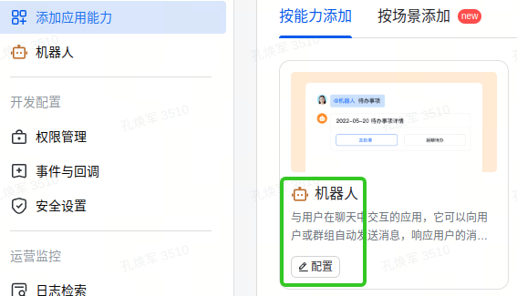
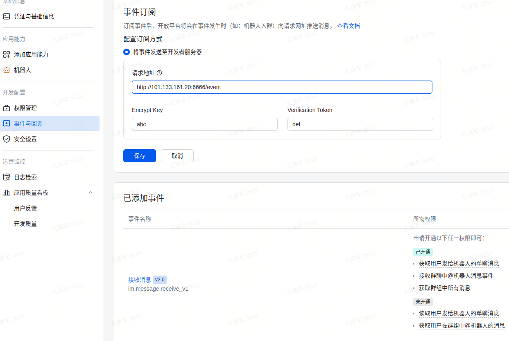
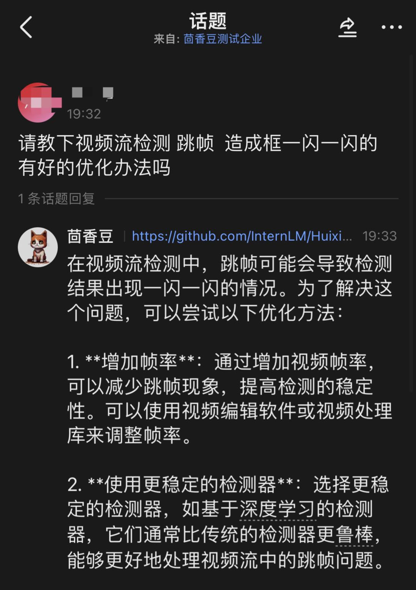

# 集成飞书群聊收发和撤回

接入飞书完整功能需要公网 IP。假设使用[阿里云 ECS](https://www.aliyun.com/product/ecs)（学生免费版即可）、假设公网 IP 是 `101.133.161.20`。且已配置[安全组](https://help.aliyun.com/zh/ecs/user-guide/overview-44)，外部可访问 `6666` 端口号，尤其是部署飞书的云服务器公网地址能够访问。

常见地，有公网 IP 的机器往往没有 GPU，我们将分开部署 LLM 和飞书消息存储，**请注意命令执行时所在机器**。


## 一、创建测试企业

测试企业是开发期间使用的测试环境，不需要正式权限审核。正式上线前都应该用测试企业的配置运行代码。

**STEP1.** 打开[飞书开发者平台-开发者后台-创建企业自建应用](https://open.feishu.cn/app?lang=zh-CN)


**STEP2.** 点击应用头像，创建测试企业


**STEP3.** 切换到测试企业，开始配置


## 二、配置机器人权限

**STEP1.** 在阿里云 ECS（101.133.161.20 机器）上，安装 redis-server 和依赖

```bash
# Ubuntu 启动 redis-server
sudo apt install redis-server
redis-server
..

# 在 CentOS 和 Red Hat 系统中，首先添加 EPEL 仓库，然后更新 yum 源
sudo yum install epel-release
sudo yum update
# 然后安装 redis 数据库
sudo yum -y install redis
# 安装好后启动 redis 服务即可：
sudo systemctl start redis
..
```

确保 redis 在后台已经活跃


启动群聊消息监听

```
# ECS 上，开个新终端，启动消息监听 6666 端口号
cd huixiangdou
python3 -m pip install -r requirements-lark-group.txt
python3 -m huixiangdou.frontend.lark_group
..
* Running on all addresses (0.0.0.0)
* Running on http://127.0.0.1:6666
* Running on http://101.133.161.20:6666
Press CTRL+C to quit
```

**STEP2.** 飞书开发者平台-添加应用能力-机器人



**STEP3.** 配置机器人的回调地址

我们以`http://101.133.161.20:6666/event` 为例，点击右侧“验证”按钮，ECS 应能收到一条消息，此时还未配置 key 和 token 会报错。


这一步也需要同步配置加解密策略，防止解析报错：


**STEP4.** 权限管理-添加权限

在测试企业中，添加权限不需要审批。以下是所需权限列表，搜索添加

```
* 读取群消息
* 获取群组信息
* 获取与发送单聊、群组消息
* 接收群聊@机器人消息事件
* 获取群组中所有消息
* 获取用户发给机器人的单聊消息
* 获取单聊、群组消息
* 以应用的身份发消息
```

**STEP5.** 事件与回调-事件订阅

配置请求地址，假设 key 是 `abc`，token 是 `def`；添加事件 “接收消息 v2.0”



此时可在飞书 APP 上，**打开测试企业**，把应用“茴香豆” 加进群组。

1. 在群里发消息，ECS 应保存到 redis 中

2. 可以用 `curl -X POST -H "Content-Type: application/json" http://101.133.161.20:6666/fetch` 读取 redis 中的消息
   测通的样例：
   

3. 为了能及时撤回。 用户依次发送 4 条消息：“1、2、3、豆哥撤回”，接收顺序应该是 “豆哥撤回、1、2、3”

## 三、测试完整收发、撤回功能

打开应用-凭证与基础信息，获取 App ID 和 App Secret，连同之前的 key、token 和回调地址，一起填入 `config.ini`。

消息类型改成 `lark_group`

```ini
[frontend]
type = "lark_group"
..
# ECS 回调地址
webhook_url = "http://101.133.161.20:6666/fetch"

[frontend.lark_group]
# "lark_group" configuration examples, use your own app_id and secret !!!
app_id = "cli_a53a34dcb7785xxx"
app_secret = "2ajhg1ixSvlNm1bJkH4tJhPfTCsGGXXX"
encrypt_key = "abc"
verification_token = "def"
```

如同 README 运行测试，执行 `main`

```shell
python3 -m huixiangdou.main  --standalone
..
======== Running on http://0.0.0.0:8888 ========
(Press CTRL+C to quit)
```

输入技术问题，茴香豆会作答；在群组里输入“豆哥撤回”，助手将撤回发送过的所有消息。



## 四、正式上线

切换回正式版本。添加权限、设置回调地址。

点击“版本管理与发布-创建版本”，等待管理员审核上线。

## 五、FAQ

1. 如果`curl -X POST -H "Content-Type: application/json" http://101.133.161.20:6666/fetch`执行超时如下图。
   
   解答：如果你的GPU机器有公网IP，修改webhook url地址为127.0.0.1
   

2. 报错huggingface_hub.utils.\_validators.HFValidationError: Repo id must be in the form
   repo_name' or 'namespace/repo_name': '/data/bcee-embedding-base v1'. Use`repo_type` argument if needed
   
   解答：sentence_transformers包的bug,包版本降到2.2.2可以修复。
