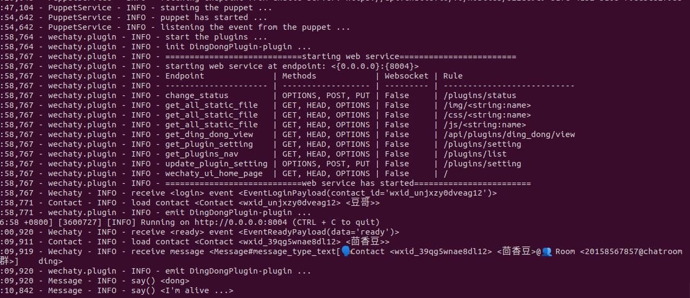
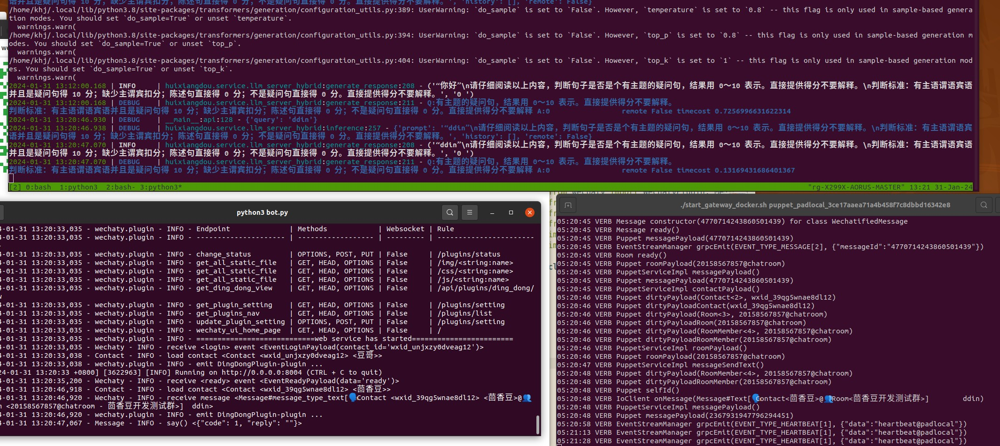

# 集成 wechaty 魔改版个人微信（不推荐）

> \[!NOTE\]
>
> <div align="center">
> wechaty 魔改法有诸多缺陷，请使用 android APK 免费版或 `main.py` 中 wechat_wkteam 类付费版。
> </div>

截止 2024.01.30，想在个人微信群收发消息，潜在思路有这些：

```
😔 优先向官方求助。确认还没有正式渠道
🙄 企微/公众号。机器人被设计成“应用”而非“用户”，运行有诸多限制
😮‍💨 微信 PC web 版/ QQ 浏览器版/ 统信 UOS 版。目前新号/新版无法登录
🤐 Hook 进程，汇编调用函数。类似“金山游侠”
🤨 模拟器。类似 Selenium/Appium 自动化，不稳定
🤔 OCR。类似原神 AI 辅助工具，很难保证识别精度
```

⚠️ **所有非正式途径都有封号等风险，自行承担**。

本文介绍 [python-wechaty](https://github.com/Wechaty/python-wechaty/) 魔法接入（ipadLogin 方式），限时免费。

需要注意，**wechaty 很早就不维护了**，如果是个人使用，推荐用 [accessibility 方法](./add_wechat_accessibility_zh.md)。

## 一、准备工作

申请一个测试账号，例如用户名为“豆哥”。

保证 linux 时区正确。以 `Asia/Shanghai` 为例，`/etc/localtime` 和 `/etc/timezone` 要对齐

```Shell
$ cat /etc/timezone
Asia/Shanghai
$ ls -l /etc/localtime
lrwxrwxrwx 1 root root 33 11月 17  2022 /etc/localtime -> /usr/share/zoneinfo/Asia/Shanghai
```

## 二、运行 [python-wechaty-template](https://github.com/wechaty/python-wechaty-template)

**注意 [python-wechaty-template](https://github.com/wechaty/python-wechaty-template) “看起来” 已不再维护，请谨慎评估风险。**

**STEP1.** 打开 [pad-local 官网](http://pad-local.com/#/)，获取限时免费 token，如 `puppet_padlocal_xxx`。

**STEP2.** 启动 gateway。终端弹出二维码链接后，扫码登录。

首次运行可能要多扫几次，成功应出现 “IoClient 豆哥 logged in” 日志。

```Shell
$ git clone https://github.com/wechaty/python-wechaty-template
$ cd python-wechaty-template
$ ./start_gateway_docker.sh puppet_padlocal_xxx
..
Online QR Code Image: https://wechaty.js.org/qrcode/http%3A%2F%2..
..
04:01:56 INFO IoClient 豆哥 logged in
```

gateway 仅仅是持续监听 8080 端口的消息代理，并不执行业务逻辑。

**STEP3.** 打开新终端，安装依赖，调整 3 处代码。[这里](https://github.com/tpoisonooo/python-wechaty-template/pull/1) 有修改好的 3 个文件供对比。

```Shell
cd python-wechaty-template
python3 -m pip install "urllib3<2.0.0"  # 老项目需要老的 urllib3
python3 -m pip install -r requirements.txt

# 第一处, docker 首次启动没有 `bot`
cat Makefile
dockerrun:
    docker stop bot && docker rm bot # 删除这行
    docker run -it -d -v $(P):/bot --name bot -p 8004:8004 py-wechaty-template-bot:latest

# 第二处，已安装的 puppet server 不存在，注释 ping、把 IP 改成 localhost
cat ~/miniconda3/lib/python3.9/site-packages/wechaty_puppet_service/puppet.py
..
893         # if ping_endpoint(self.options.end_point) is False:
894         #     raise WechatyPuppetConfigurationError(
895         #         f"can't not ping endpoint: {self.options.end_point}"
896         #     )  注释这个判断
897
898         host, port = extract_host_and_port(self.options.end_point)
899         host = '127.0.0.1'  # 增加这句
900         self.channel = Channel(host=host, port=port)

# 第三处，样例插件未完全实现导致崩溃，只保留 `DingDongPlugin`
cat bot.py
..
    bot.use([
        DingDongPlugin(),
#        RepeaterPlugin(), 注释这些插件
#        InfoLoggerPlugin(),
#        CounterPlugin(),
#        UICounterPlugin(),
#        GithubMessageForwarderPlugin(
#            endpoint=os.environ.get('github_endpoint', None) or "your-custom-endpoint"
#        ),
    ])
```

**STEP4.** `Makefile` 编译运行测试样例

```bash
make bot
python3 bot.py  # 确保这两句没有崩溃
```

`bot.py` 应能看到这些日志：



成功后打开微信，发送 `ding` 可以收到 `dong`


**STEP5.** 集成 HuixiangDou

假设你已经读过 README，能够运行 `STEP2. 运行基础版技术助手`。那么修改 `config.ini`，服务类型改成 `wechat_personal`，运行 `main` 默认会监听 9527 端口。

```Shell
# config.ini
..
[frontend]
type = "wechat_personal"

python3 -m huixiangdou.main --standalone # 非 docker 用户
python3 -m huixiangdou.main # docker 用户
..
======== Running on http://0.0.0.0:9527 ========
(Press CTRL+C to quit)
```

用 `curl -X POST -H "Content-Type: application/json" -d '{"query":"你好"}'  http://127.0.0.1:9527/api` 可以测试效果。

调整 [ding_dong.py on_message()](https://github.com/wechaty/python-wechaty-template/blob/main/src/plugins/ding_dong.py#L10)，把消息发给 9527 端口，返回响应。
[这里](https://github.com/tpoisonooo/python-wechaty-template/blob/main/src/plugins/ding_dong.py) 是修改好的代码。

这是最终运行起来的 3 个终端：

- 上面是 HuixiangDou 服务
- 左下是 `app.py`
- 右下是 python-wechaty gateway



## FAQ

- `make bot` 报错 `multiple target patterns`。可能 `Makefile` 多删了一行空白
- `make bot` 第二次执行，报错 `/bot is already in use`。恢复 `Makefile` 的修改即可。 第一次运行不存在 bot，所以要删掉那行； 第二次已经存在了。或者手工删除容器也可以。
- 运行 `python3 bot.py` 时，报错 `cannot import name 'get_host' from 'urllib3' ` 为 urllib3 版本问题，根据 [python-wechaty-issue](https://github.com/wechaty/python-wechaty/issues/419#issuecomment-1859148951) 执行 `pip install "urllib3<2.0.0"` 得以解决。
