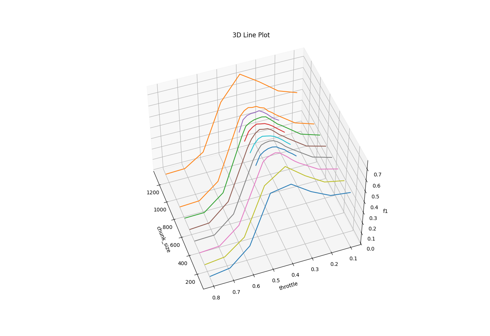

# HuixiangDou Evaluation

## Rejection

通过本测试，得到了 text2vec 模型中 chunksize 上下界。见[text2vec 如何选择 chunksize 和 splitter](https://zhuanlan.zhihu.com/p/704311157)。

### **1.1 数据说明**

使用的知识库是 openmmlab 相关的 9 个 repo 中的所有 markdown、txt 和 pdf 文档。

累计 1150 个。文档长度均值 5063；长度中位数 2925。

即以下 repo 的文档部分做知识库：

```bash
git clone https://github.com/open-compass/opencompass --depth=1
git clone https://github.com/open-mmlab/mmpose --depth=1
git clone https://github.com/open-mmlab/mmdeploy --depth=1
git clone https://github.com/open-mmlab/mmdetection --depth=1
git clone https://github.com/internlm/lmdeploy --depth=1
git clone https://github.com/internlm/huixiangdou --depth=1
git clone https://github.com/internlm/xtuner  --depth=1
git clone https://github.com/open-mmlab/mmyolo --depth=1
git clone https://github.com/open-mmlab/mmcv --depth=1
```

query 来自 openmmlab 用户群和 ncnn 开发者群，累计 2302 条问题。通过人工标注，判定问题与知识库是否相关。数据见 [正例](https://github.com/tpoisonooo/huixiangdou-evaluation-results/blob/main/rejection/gt_good.txt) 和 [负例](https://github.com/tpoisonooo/huixiangdou-evaluation-results/blob/main/rejection/gt_bad.txt)。

### **1.2 测试方法**

把正反例填进 `gt_bad.txt` 和 `gt_good.txt`。执行：

```
python3 evaluation/rejection/build_fs_and_filter.py
```

这个代码会打开调试模式，统计 tokenize 后的长度。

为了让 token 长度刚好和模型匹配（如 512），自行调整 chunksize 参数。

```
# build_fs_and_filter.py
# 改成希望的长度，如 1240。
calculate(1240)

# 支持多进程测试，提高效率
pool = NestablePool(6)
result = pool.map(calculate, range(128, 512, 32))
pool.close()
pool.join()
print(result)
```

使用 `python3 plot.py` 绘制不同 chunksize 和 throttle 下的 F1。结果样例：



### **1.3 测试结论**

对 bce-embedding-base_v1

- chunksize 范围应在 (512, 1500)
- 右值取到的最佳 F1@throttle 为 75.39@0.41
- chunksize 取 640 时，F1 可达到 75.88

对 bge-large-zh-v1.5

- chunksize 范围应在 (423, 1240)
- embedding.tokenzier 的压缩率略低
- 右值取到的最佳 F1@throttle 为 72.23@0.34

splitter 选择依据

- 中文优先 `ChineseTextSplitter`，会出现离心值
- 英文 `langchain.RecursiveTextSplitter`，切中文语料更碎但没有离心值
- `CharacterTextSplitter` 实际没切片作用，避免直接用

### **1.4 方案对比**

我们也对比了其他办法和模型：

|      方案      | F1 score |                                                                             说明                                                                              |
| :------------: | :------: | :-----------------------------------------------------------------------------------------------------------------------------------------------------------: |
| bce+knowlegegraph | 77.68 | 知识图谱权重占比 10%，初始阈值用 0.46，属性能检索到 5 个 chunk 则影响阈值 |
|      bce      |  75.88   | 使用 [bce-embedding-base_v1](https://github.com/netease-youdao/BCEmbedding) 配合特定 splitter 测试。注意不合适的 splitter 和 distance_strategy 会严重影响精度 |
| bge-v1.5-large |  72.23   |                                           使用 [bge-large-zh-v1.5](https://github.com/FlagOpen/FlagEmbedding) 测试                                            |
|     bge-m3     |  70.62   |           使用 [m3](https://github.com/FlagOpen/FlagEmbedding) dense retrieval。注意 m3 最大输入 token 长度 8192，测试数据无法完整发挥模型编码能力            |
| bge-m3 dense+sparse  |  63.85   |    基于 [milvus WeightedRanker](https://github.com/milvus-io/milvus) 测试 [m3](https://github.com/FlagOpen/FlagEmbedding) dense+sparse retrieval 拒答效果。sparse 占比越高效果越差  |
