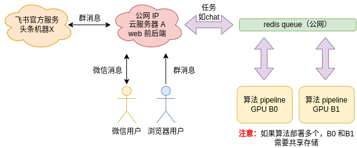

# Web

web 版本前后端源码，效果同 https://openxlab.org.cn/apps/detail/tpoisonooo/huixiangdou-web

整个服务分 **前后端** 和 **算法** 两部分：

- 中间用 redis queue 通信，可以视做**消息总线**
- 后端接受所有业务侧消息，例如微信、飞书、浏览器等
- 算法无状态，只关心算法相关的任务。可分布式扩展以应对高吞吐需求



## 启动

1. 先安装 Redis，如果你已经安装 Redis 服务，并且配置好了 Redis 密码，启动了 Redis 服务，直接跳过这一步即可。

```bash
# 以 Ubuntu 系统为例
# 安装 Redis 服务和客户端
sudo apt install redis-server redis-tools

# 设置 Redis 密码（默认配置文件在/etc/redis/redis.conf），比如设置为：redis123
sudo vim /etc/redis/redis.conf
# 将 requirepass your_password_here 注释打开并修改为如下内容，保存即可
requirepass redis123

# 启动redis
sudo redis-server /etc/redis/redis.conf
# 查看redis是否启动成功
netstat -nlpt | grep redis
```

2. 设置环境变量，需要配置的环境变量如下（你可以将这些环境变量添加到~/.bashrc文件的末尾，然后 `source ~/.bashrc` 刷新配置）

```bash
$ cat env.sh

export PYTHONUNBUFFERED=1
# Redis 的 IP 地址
export REDIS_HOST=10.1.52.22
# Redis 的密码
export REDIS_PASSWORD=${REDIS_PASSWORD}
# Redis 的端口，默认为 6379
export REDIS_PORT=6380
# JWT_SECRET 是指用于签名 JSON Web Token (JWT) 的密钥或密钥对，可以使用 `openssl rand -base64 32` 命令生成
export JWT_SECRET=${JWT_SEC}
# 茴香豆的后台服务端口，可以自定义
export SERVER_PORT=7860
# 飞书的 LARK_ENCRYPT_KEY，参考地址：https://open.larksuite.com/document/server-docs/event-subscription/event-subscription-configure-/request-url-configuration-case
# 如果不需要接通飞书忽略即可
export HUIXIANGDOU_LARK_ENCRYPT_KEY=thisiskey
export HUIXIANGDOU_LARK_VERIFY_TOKEN=sMzyjKi9vMlEhKCZOVtBMhhl8x23z0AG

# set your service endpoint(open to Internet callback from lark and wechat)
# 回调端口，建议填写 7860，然后将 7860 端口通过公网 IP 代理出去，例如 http://10.1.52.36:18443
export HUIXIANGDOU_MESSAGE_ENDPOINT=http://10.1.52.36:18443
# 如果使用 https 安全连接就把 COOKIE_SECURE 设置为 1；如果不是，则将 `export COOKIE_SECURE=1` 替换为 `unset COOKIE_SECURE`
export COOKIE_SECURE=1
```

⚠️ 重要事项：  如果不用 https 安全链接，需要 `unset COOKIE_SECURE`（不是设成 0）。否则知识库登录会异常

> 怎么算是用 https ？ 就是**你买了域名且能 https 打头， 如果你用的是裸 ip 地址，那就是没有！**
>
> 例如：
>
> https://openxlab.com/api    是 https，需要 `export COOKIE_SECURE=1`
>
> https://10.1.2.22   不是，取消 cookie
>
> http://101.204.1.5  不是

3. 编译前端 & 运行后端服务

安装 Node.js `npm` (需要版本为 20.x , 安装时, 可根据用户权限需要自行添加 sudo + 命令)

```bash
apt update
apt install nodejs npm
node -v # v20.12.0
```

如果 `node -v` 版本太老 （10.x），则需要升级 node 版本

```bash
npm install n -g
n stable
hash -r
node -v # v20.12.0
```

编译项目

```bash
cd front-end
npm install && npm run build
```

安装依赖、运行后端

```bash
cd ../../ # 从front-end返回到huixiangdou目录下, 该目录内含有web文件夹
python3 -m pip install -r web/requirements.txt
python3 -m web.main
```

4. 运行算法 pipeline

```bash
# 先开个终端窗口，启动 LLM hybrid proxy
python3 -m huixiangdou.service.llm_server_hybrid --config_path config.ini

# 再开个窗口，监听服务
python3 -m web.proxy.main
```

5. 测试
   打开服务器 7860 端口，创建知识库测试效果
